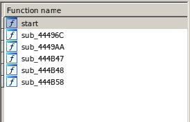
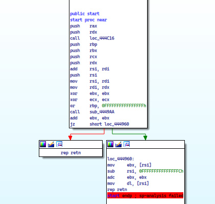
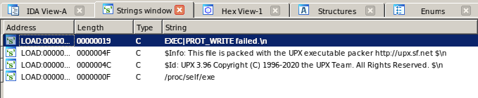
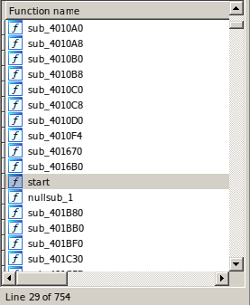
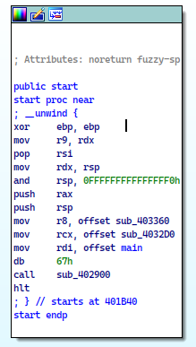
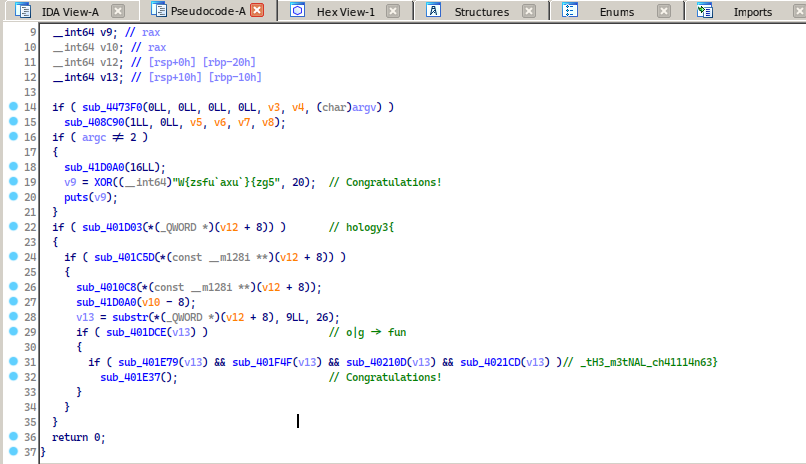
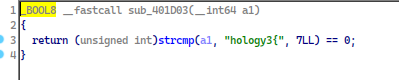
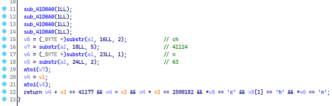

<div style="text-align: justify">

# Jotunheim

### Deskripsi
```
Easy crackme and get your flag

Author: rockwell
```

### Problem
Pada tantangan ini kami diberikan file binary [*crackme*](crackme), untuk mengeksekusi program tersebut kita diminta untuk memasukan sebuah argument.

```
~/CTFI/202/Ho/Final-CTF/Reversing/Jotunheim ❯ ./crackme                                          
[2]  + 14975 segmentation fault  ./crackme
~/CTFI/202/Ho/F/Reversing/Jotunheim ❯ ./crackme asd                                       ✘ SEGV 
~/CTFI/202/Ho/Final-CTF/Reversing/Jotunheim ❯ ./crackme asd asd                                  
Congratulations!
```

   

Setelah membuka file binary tersebut menggunakan IDA, kita hanya mendapatkan beberapa fungsi. Sedikit membingungkan untuk melakukan static analysis pada program tersebut dan akan sangat membuang waktu untuk melakukan debugging.



Pada *Strings window* kita hanya akan menemukan beberapa string dan yang menarik perhatian kami adalah string `This file is packed with the UPX executable packer`. dan kami mulai mencari tahu tentang *UPX*.

Setelah melakukan searching tentang *UPX* kami menyadari bahwa *UPX* [(Ultimate Packer for eXecutables)](https://upx.github.io/) adalah tool yang digunakan untuk kompres/dekompres file binary/executable lainnya.

### Solution
Untuk mengembalikan program kebentuk awalnya kita dapat menggunakan tool *UPX* untuk melakukan dekompres pada file binary tersebut.

Berikut adalah hasil setelah file binary tersebut di dekompres, ukurannya cukup berbeda dari 278K -> 699K.
```
~/CTFI/202/Ho/Final-CTF/Reversing/Jotunheim ❯ upx -d crackme -o crackme_unpacked
                       Ultimate Packer for eXecutables
                          Copyright (C) 1996 - 2020
UPX git-d7ba31+ Markus Oberhumer, Laszlo Molnar & John Reiser   Jan 23rd 2020

        File size         Ratio      Format      Name
   --------------------   ------   -----------   -----------
    715272 <-    284068   39.71%   linux/amd64   crackme_unpacked

Unpacked 1 file.

~/CTFI/202/Ho/Final-CTF/Reversing/Jotunheim ❯ ll
total 8,3M
-rwxr-xr-x 1 unknow unknow 278K Nov 14 14:41 crackme
-rwxr-xr-x 1 unknow unknow 699K Nov 14 14:41 crackme_unpacked
```

Jika kita membuka file binary [*crackme_unpacked*](crackme_unpacked) kita akan melihat ada banyak fungsi, mulai dari sini kami langsung melakukan static analysis.

 

Setelah beberapa menit melakukan static analysis kami mendapatkan beberapa fungsi yang menarik diantaranya `XOR`, `puts`, `strcmp`, `substr`, `atoi`.

  

Berikut ini adalah output dari [*solver*](solver.py) yang kami buat.
```
~/CTFI/202/Ho/Final-CTF/Reversing/Jotunheim ❯ python solver.py
hology3{fun_th3_m3tNAL_ch41114n63}
```

FLAG : `hology3{fun_tH3_m3tNAL_ch41114n63}`


Referensi:
 - [*upx tools*](https://upx.github.io/)
 - [*dissecting manual unpacking of a upx packed file*](https://tech-zealots.com/reverse-engineering/dissecting-manual-unpacking-of-a-upx-packed-file/)
</div>
