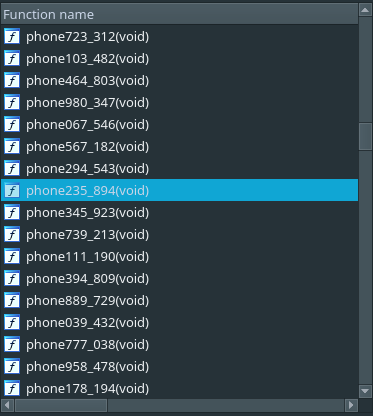
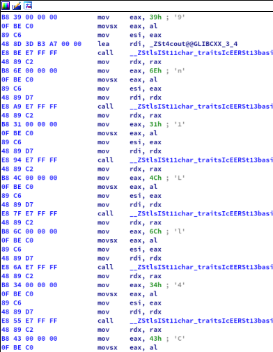

<div style="text-align: justify">

# Telfon saya untuk mengetahui flagnya

### Deskripsi
```
Anda bekerja sebagai penjawab telepon dari setiap panggilan darurat, tentu anda harus cakap dalam berbicara agar orang-orang tidak tersinggung. Setiap harinya ada selalu ada yang menelfon dan terkadang ada juga yang melakukan "Prank Call" kepada anda, mereka juga berpura-pura seperti orang yang benar-benar membutuhkan panggilan darurat sehingga anda harus berhati-hati. Suatu hari ada panggilan darurat masuk yang mengatakan kalau dia memiliki sebuah "flag". Carilah penelpon tersebut dan berhati-hati terhadap prank call karena dapat merusak informasi yang akan diperoleh!

Format flag = hology3{flag}

Author: aldifp01
```

### Problem
Pada tantangan ini kita diberikan file binary [*911.exe*](911.exe), setelah mengeksekusi program tersebut, program meminta sebuah inputan dari user dan tidak banyak informasi yang bisa kita dapatkan dari output tersebut.

```
~/CTFI/202/Ho/F/R/Telfon saya untuk mengetahui flagnya ❯ ./911.exe
Ada panggilan darurat yang masuk, angkat?
Y/N??    : N
Mau mengecek informasi yang ada peroleh tadi?
Y/N??    : Y
Masukan input   : asdasdasd
Tim penerjemah : Maaf kami tidak bisa mengartikannya
Ada panggilan darurat yang masuk, angkat?
Y/N??    : Y
Penelpon : "Halo panggilan darurat? Saya membutuhkan bantuan apakah anda dapat membantu saya?"
Ada seseorang yang memanggil panggilan darurat, apakah anda ingin membicarakan tentang rumor flag tersebut?"
Y/N??    : asdasdasd
Masukan input yang benar!Penelpon : "Flag apa? apa yang anda bicarakan saya tidak tau apapun tentang flag"
[1]    13026 abort (core dumped)  ./911.exe
```

Saat melakukan static analysis kita dapat melihat ada banyak sekali fungsi `phone<num>_<num>` dengan num yang berbeda-beda. Setelah menghabisakan beberapa menit menggali, kami menemukan salah satu dari fungsi `phone<num>_<num>` yang memiliki instruksi yang sama digunakan dengan tantangan yang sebelumnya [**"not_so_l0ng"**](../not_so_l0ng)

  

### Solution

Setelah mengetahui bahwa file binary tersebut memiliki instruksi yang sama dengan tantangan sebelumnya, kami memutuskan untuk menggunakan Yara rule [*creds.yara*](creds.yara) yang sebelumnya sudah kami buat.

Berikut adalah potongan hasil dari output [*creds.yara*](creds.yara).

```
~/CTFI/202/Ho/F/R/Telfon saya untuk mengetahui flagnya ❯ yara -s creds.yara 911.exe
yarp 911.exe
0x397c:$op_code0: B8 39 00 00 00 0F BE C0 89 C6
0x3995:$op_code0: B8 6E 00 00 00 0F BE C0 89 C6
0x39aa:$op_code0: B8 31 00 00 00 0F BE C0 89 C6
0x39bf:$op_code0: B8 4C 00 00 00 0F BE C0 89 C6
0x39d4:$op_code0: B8 6C 00 00 00 0F BE C0 89 C6
0x39e9:$op_code0: B8 34 00 00 00 0F BE C0 89 C6
0x39fe:$op_code0: B8 43 00 00 00 0F BE C0 89 C6
0x45e4:$op_code0: B8 4E 00 00 00 0F BE C0 89 C6
0x45fd:$op_code0: B8 30 00 00 00 0F BE C0 89 C6
0x4612:$op_code0: B8 31 00 00 00 0F BE C0 89 C6
0x4627:$op_code0: B8 37 00 00 00 0F BE C0 89 C6
0x463c:$op_code0: B8 63 00 00 00 0F BE C0 89 C6
0x4651:$op_code0: B8 4E 00 00 00 0F BE C0 89 C6
0x4666:$op_code0: B8 55 00 00 00 0F BE C0 89 C6
0x467b:$op_code0: B8 46 00 00 00 0F BE C0 89 C6
0x5d49:$op_code0: B8 6D 00 00 00 0F BE C0 89 C6
0x5d62:$op_code0: B8 30 00 00 00 0F BE C0 89 C6
0x5d77:$op_code0: B8 72 00 00 00 0F BE C0 89 C6
0x5d8c:$op_code0: B8 46 00 00 00 0F BE C0 89 C6
0x64c7:$op_code0: B8 72 00 00 00 0F BE C0 89 C6
0x64e0:$op_code0: B8 33 00 00 00 0F BE C0 89 C6
0x64f5:$op_code0: B8 39 00 00 00 0F BE C0 89 C6
0x650a:$op_code0: B8 39 00 00 00 0F BE C0 89 C6
0x651f:$op_code0: B8 55 00 00 00 0F BE C0 89 C6
0x6534:$op_code0: B8 62 00 00 00 0F BE C0 89 C6
0x6549:$op_code0: B8 33 00 00 00 0F BE C0 89 C6
0x655e:$op_code0: B8 44 00 00 00 0F BE C0 89 C6
0x24cf:$op_code1: BE 5F 00 00 00
```

```
~/CTFI/202/Ho/F/R/Telfon saya untuk mengetahui flagnya ❯ echo $(yara -s creds.yara 911.exe | awk '{print "\\x"$3}') | tr -d ' '
9n1Ll4CN017cNUFm0rFr399Ub3D_
```

FLAG : `hology3{_C4lL1n9_FUNc710N_Fr0m_D3bU993r_}`

</div>
