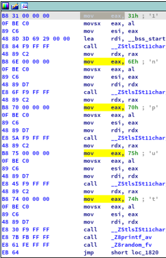
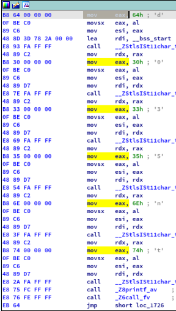

<div style="text-align: justify">

# not_so_l0ng

### Deskripsi
```
To get the flag, input a number that not too long

Author: aldifp01
```

### Problem
Pada tantangan ini kita diberikan sebuah file binary [*not-so-l0ng*](not-so-l0ng.tar.gz). Ketika kita mengeksekusi program tersebut, kita diminta untuk memasukan sebuah inputan.

Selama melakukan static analysis, kami menemukan beberapa instruksi disassembly yang kami duga adalah flag.

Berikut ini adalah screenshot dari potongan kode disassembly dari program tersebut.

  

Jika diperhatikan keduanya memiliki instruksi dan opcode yang hampir sama dengan nilai karakter yang berbeda-beda.

### Solution
Untuk menyelesaikan tantangan ini kami menggunakan yara untuk mengambil karakter yang kami duga adalah flag dari opcode program tersebut

Berikut adalah potongan hasil dari output rule [*creds.yara*](creds.yara) yang kami buat.
```
~/CTFIndo/2020/Hology3.0/Final/Reversing/not_so_l0ng ❯ yara -s creds.yara not-so-l0ng.apk
yarp not-so-l0ng.apk
0x1364:$op_code0: B8 69 00 00 00 0F BE C0 89 C6
0x137d:$op_code0: B8 6E 00 00 00 0F BE C0 89 C6
0x1392:$op_code0: B8 74 00 00 00 0F BE C0 89 C6
0x13a7:$op_code0: B8 33 00 00 00 0F BE C0 89 C6
0x13bc:$op_code0: B8 39 00 00 00 0F BE C0 89 C6
0x13d1:$op_code0: B8 65 00 00 00 0F BE C0 89 C6
0x13e6:$op_code0: B8 72 00 00 00 0F BE C0 89 C6
0x147e:$op_code0: B8 6D 00 00 00 0F BE C0 89 C6
0x1497:$op_code0: B8 34 00 00 00 0F BE C0 89 C6
0x14ac:$op_code0: B8 78 00 00 00 0F BE C0 89 C6
0x154e:$op_code0: B8 70 00 00 00 0F BE C0 89 C6
0x1567:$op_code0: B8 34 00 00 00 0F BE C0 89 C6
0x157c:$op_code0: B8 73 00 00 00 0F BE C0 89 C6
0x1591:$op_code0: B8 35 00 00 00 0F BE C0 89 C6
0x1637:$op_code0: B8 64 00 00 00 0F BE C0 89 C6
0x1650:$op_code0: B8 30 00 00 00 0F BE C0 89 C6
0x1665:$op_code0: B8 33 00 00 00 0F BE C0 89 C6
0x167a:$op_code0: B8 35 00 00 00 0F BE C0 89 C6
0x168f:$op_code0: B8 6E 00 00 00 0F BE C0 89 C6
0x16a4:$op_code0: B8 74 00 00 00 0F BE C0 89 C6
0x1746:$op_code0: B8 31 00 00 00 0F BE C0 89 C6
0x175f:$op_code0: B8 6E 00 00 00 0F BE C0 89 C6
0x1774:$op_code0: B8 70 00 00 00 0F BE C0 89 C6
0x1789:$op_code0: B8 75 00 00 00 0F BE C0 89 C6
0x179e:$op_code0: B8 74 00 00 00 0F BE C0 89 C6
0x1334:$op_code1: BE 5F 00 00 00
```

```
~/CTFIndo/2020/Hology3.0/Final/Reversing/not_so_l0ng ❯ echo $(yara -s creds.yara not-so-l0ng.apk | awk '{print "\\x"$3}') | tr -d ' '
int39erm4xp4s5d035nt1nput_
```

FLAG : `hology3{1nput_d035nt_p4s5_m4x_int39er}`

</div>
